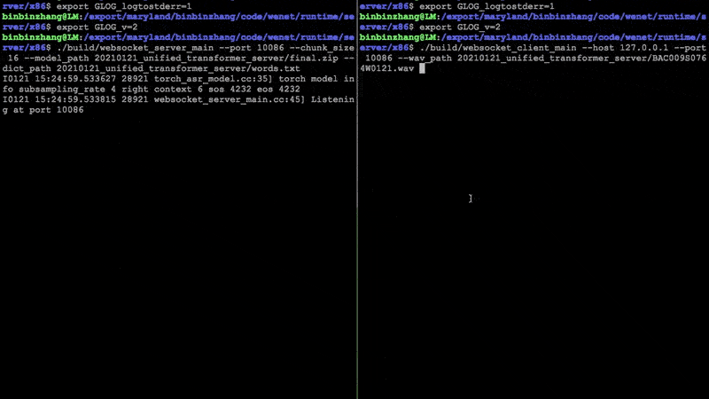

# x86 平台上使用 WeNet 进行语音识别

Wenet基于pytorch框架进行语音识别模型训练，而在使用训练好的Wenet模型进行真实场景的语音识别任务时，需要更高效的执行效率和一些外围组件。因此我们提供了一套基于C++实现的Wenet的语音识别工具和在线服务。

## 识别工具的编译

Wenet支持linux/macos/windows三种平台上的编译。需要安装cmake 3.14或者更高版本。

运行如下命令，完成编译。
``` sh
# 当前目录为 wenet/runtime/server/x86
mkdir build && cd build && cmake .. && cmake --build .
```

编译好的可执行程序在`wenet/runtime/server/x86/build/`下：

* decoder_main 本地文件识别工具
* websocket_server_main 基于websocket协议的识别服务端
* websocket_client_main 基于websocket协议的识别客户端

## 预训练模型

除了使用自己训练好的语音识别模型，Wenet官方也提供了一些预训练好的模型。

* [AIShell数据训练的中文模型](http://mobvoi-speech-public.ufile.ucloud.cn/public/wenet/aishell/20210221_unified_transformer_server.tar.gz)
* [AIShell-2数据训练的中文模型](http://mobvoi-speech-public.ufile.ucloud.cn/public/wenet/aishell2/20210327_unified_transformer_exp_server.tar.gz)
* [TODO: Librispeech数据训练的英文模型](link)

下载预训练模型
``` sh
# 当前目录为 wenet/runtime/server/x86
wget http://mobvoi-speech-public.ufile.ucloud.cn/public/wenet/aishell2/20210327_unified_transformer_exp_server.tar.gz
tar -xf http://mobvoi-speech-public.ufile.ucloud.cn/public/wenet/aishell2/20210327_unified_transformer_exp_server.tar.gz
```


## 本地wav文件识别

本地文件识别，即程序每次运行时，给定一个语音文件或者一组语音文件列表，输出识别结果，然后结束程序。

下载好模型后，执行如下的命令进行本地wav文件识别，将`wav_path`设为你想测试的wav文件地址，将`model_dir`设为你的模型目录地址。

``` sh
# 当前目录为 wenet/runtime/server/x86
# 已经下载并解压20210327_unified_transformer_exp_server.tar.gz到当前目录

export GLOG_logtostderr=1
export GLOG_v=2
wav_path=./20210327_unified_transformer_exp_server/BAC009S0764W0121.wav
model_dir=./20210327_unified_transformer_exp_server
./build/decoder_main \
    --chunk_size -1 \
    --wav_path $wav_path \
    --model_path $model_dir/final.zip \
    --dict_path $model_dir/words.txt 2>&1 | tee log.txt
```

`decoder_main`工具支持两种wav文件模式：
 * 使用`-wav_path`指定单个文件，一次识别单个wav文件。
 * 使用`-wav_scp`指定一个.scp格式的wav列表，一次识别多个wav文件。


执行 `./build/decoder_main --help`  可以了解更多的参数意义。


## 基于websocket的在线识别服务

在线识别服务，即程序运行后会常驻在内存中，等待客户端的请求，对于客户端发来的语音数据进行识别，将识别文本返回给客户端。

在这个示例中，需要先启动服务端程序，然后再启动客户端发送请求。

### 启动websocket识别服务端

执行如下指令，将`model_dir`设置为你的模型目录地址。
``` sh
export GLOG_logtostderr=1
export GLOG_v=2
model_dir=./20210327_unified_transformer_exp_server
./build/websocket_server_main \
    --port 10086 \
    --chunk_size 16 \
    --model_path $model_dir/final.zip \
    --dict_path $model_dir/words.txt 2>&1 | tee server.log
```

上述服务启动后，会监听10086端口。若想使用其他端口，请修改`--port`对应的参数.

### websocket识别客户端

客户端按websocket协议去请求服务，可以用不同语言来实现客户端。我们提供了两种客户端，一种是基于C++的命令行工具。一种是基于网页形式的可视化客户端。

**命令行websocket客户端**

打开一个新的命令行窗口，运行如下指令，启动客户端。可将`wav_path`设为你想测试的wav文件地址。

```sh
export GLOG_logtostderr=1
export GLOG_v=2
wav_path=./20210327_unified_transformer_exp_server/BAC009S0764W0121.wav
./build/websocket_client_main \
    --host 127.0.0.1 --port 10086 \
    --wav_path $wav_path 2>&1 | tee client.log
```

该程序会模拟语音数据的真实时间进行流式请求，即10秒的语音会按10秒时间发送完。可以在客户端和服务器端看到流式识别过程输出的信息。




注意`--port`需要设置为服务端使用的端口号。

如果有两台机器，也可以在一台机器上运行服务端，在另一台机器运行客户端，此时`--host`要指定为服务端所在机器的可访问ip。


**网页版websocket客户端**

网页版客户端支持麦克风的语音输入。运行如下命令启动web客户端。

``` sh
pip install Flask
python web/app.py --port 19999
```

然后在浏览器里输入地址`localhost:19999`进入web客户端。

在`Websoket URL`里设置websoket识别服务的地址，比如`ws://localhost:10086`, 点击开始识别。


**时延信息计算**

server.log文件中记录了每次请求的时延，可以通过如下命令得到所有请求的平均时延。
``` sh
grep "Rescoring cost latency" server.log | awk '{sum += $NF}; END {print sum/NR}'
```


## 在docker环境中使用

如果遇到问题比如无法编译，我们也提供了一个docker镜像用于执行示例，该镜像包含了编译好的文件，预训练模型，测试数据。

需要先安装好docker，运行如下命令，进入docker容器环境。

``` sh
docker run --rm -it mobvoiwenet/wenet:v0.1.0 bash
```

我们也提供了Dockerfile，可以自己构建一个docker镜像，参考`Dockerfile`文件。
``` sh
DOCKER_BUILDKIT=1 docker build --no-cache -t wenet:latest .
docker run --rm -it wenet bash
```

预训练模型在`/home/model`目录, 可执行程序在`/home/wenet/runtime/server/x86/build`目录。
